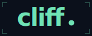
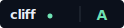

<div align="center">



**Take care of security.**

[](https://github.com/galanko/Cliff/releases)
[](https://github.com/galanko/Cliff/actions/workflows/backend.yml)
[](https://github.com/galanko/Cliff/actions/workflows/frontend.yml)
[](LICENSE)
[](ROADMAP.md)

<a href="docs/guides/badge.md"></a>

</div>

---

The security industry was built for companies with security teams. The next ten years won't have those companies.

Cliff is the AI security teammate every team without a security team needs. Drop in a finding — from Snyk, Trivy, your own scanner, or a CSV — and Cliff opens a workspace, enriches the context, finds the owner, drafts the plan, files the ticket, and validates the close. Most teams cut their per-CVE workflow from days to about an hour. You steer; Cliff does the legwork.

Built on [OpenCode](https://github.com/anomalyco/opencode). Self-hosted, AGPL-3.0, runs natively on macOS and Linux or in a single Docker container.

> Alpha. Single-user. Expect rough edges — see [ROADMAP.md](ROADMAP.md).

<!--
  HERO PRODUCT SHOT — insert when the Cyberdeck UI ships:
  <p align="center">
    
  </p>
-->

## Who Cliff is for

- **OSS maintainers** with a backlog of Dependabot PRs they don't have time to read.
- **Founders at AI-native startups** answering a 200-question security questionnaire that landed Friday.
- **Solo security engineers** at growing companies, tired of being the bottleneck between detection and remediation.

If you don't have a security team — or you *are* the security team — Cliff is for you.

## How Cliff works

Every finding moves through the same loop. Cliff drives; you check the work.

| Step | Cliff | You |
|------|-------|-----|
| Triage | Reads the finding. Checks reachability. Writes the summary. | Skim the summary. |
| Owner | Finds the team that owns the affected code via CODEOWNERS, recent commits, blame. | Confirm or override. |
| Plan | Drafts the remediation plan with the mitigation, the fix, and the definition of done. | Approve, edit, or send it back. |
| Ticket | Files the ticket in Linear, Jira, or GitHub Issues with the plan attached. | — |
| PR | If a code fix exists, drafts the PR. Otherwise tracks the external work. | Review and merge. |
| Validate | Rescans. Confirms closure. Recommends close or reopen. | Mark closed. |

Each step persists into both the chat timeline and a structured sidebar. Re-opening a finding three months later picks up where it left off — security work that compounds, instead of resetting every Monday.

## Quick start

**macOS or Linux** — no Docker required, about two minutes:

<!-- install:start -->
```bash
curl -fsSL https://github.com/galanko/Cliff/releases/latest/download/install-local.sh | sh
cliff start --detach
```
<!-- install:end -->

Open [http://127.0.0.1:8000](http://127.0.0.1:8000) and paste your Anthropic or OpenAI key in Settings.

The installer fetches `uv`, a managed Python 3.11, the OpenCode binary, and the Trivy and Semgrep scanners. Prereqs: `git`, `curl`, and the [GitHub CLI](https://github.com/cli/cli#installation). If something doesn't run, `cliff doctor` will say why.

**Docker** — required on Windows, optional everywhere else. Prereqs: Docker 24+.

```bash
curl -fsSL https://github.com/galanko/Cliff/releases/latest/download/install.sh | sh
```

Manual install, image verification, and platform notes are in [docs/install.md](docs/install.md).

## Use Cliff inside Claude Code

Already in [Claude Code](https://claude.com/claude-code)? You can skip the web UI. After running the installer above, register the plugin marketplace and install `secure-repo`:

```text
/plugin marketplace add galanko/Cliff
/plugin install secure-repo@cliff
```

Then in any git repo, ask:

> *Hey Cliff, take care of this repo.*

Cliff scans the codebase, opens a workspace per finding, and walks you from plan to PR to merge to close. You approve the plan. You approve the merge. You mark closed. Cliff handles the rest.

## Earn the badge

What if your security posture was as legible as your build status?

Cliff scores your repo continuously and issues a public badge for your README — A through F. Closed criticals, no committed secrets, posture checks passing: that's the work that earns it. The badge is a signal — to potential users, to the enterprise prospect who just sent you a security questionnaire, to yourself — that someone on this project takes care of the boring parts.

The badge in the hero is the one Cliff issues for itself.

[Read the rubric](docs/guides/badge.md)

## Architecture and docs

- [Architecture overview](docs/architecture/overview.md)
- [Connect a GitHub repo](docs/guides/setup-github-app.md) — one-click GitHub App + device flow
- [ADRs](docs/adr/) — every significant decision, with the trade-offs
- [Roadmap](ROADMAP.md)
- [Contributing](.github/CONTRIBUTING.md)
- [Security policy](SECURITY.md) · [License](LICENSE)

## About

Cliff is a product of Cliff — a small team that publishes its bug bounty methodology and the tools that apply it. Cliff is the remediation copilot; Cliff is the lab.

Both exist because the founder was the security person for his own projects and got tired of being it.

---

<div align="center">
  <sub>AGPL-3.0 · built by <a href="https://github.com/galanko">@galanko</a> · security should feel like shipping, not filing tickets.</sub>
</div>
